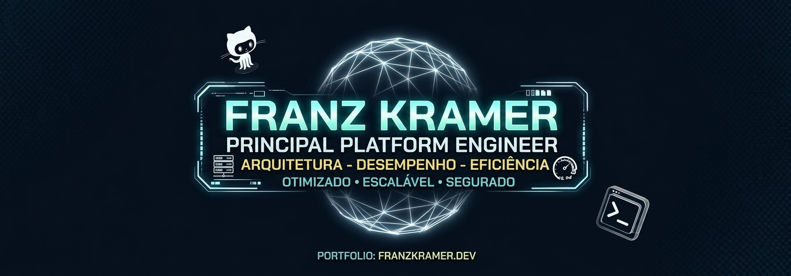
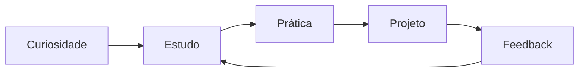

<div align="center">



### Desenvolvedor em formação | Tecnologia, aprendizagem e construção de soluções

<p>
	Transformo curiosidade em projetos, estudo em prática e ideias em experiências digitais.
</p>

<a href="https://github.com/franzkramerfr">
	
</a>
<a href="mailto:SEU_EMAIL_AQUI">
	
</a>

</div>

---

## Sobre mim

Sou estudante e desenvolvedor em formação, atualmente construindo minha base em tecnologia por meio de estudos, desafios práticos e projetos próprios no ambiente **SESI/SENAI**.

Gosto de entender como as coisas funcionam, transformar problemas em soluções simples e evoluir um pouco a cada projeto. Este perfil registra esse processo: o que estou aprendendo, o que estou construindo e os próximos desafios que quero encarar.

```text
Foco atual       Aprendizado consistente e desenvolvimento de projetos
Jeito de trabalhar  Curioso, organizado e orientado a soluções
Objetivo         Criar ferramentas úteis e crescer como desenvolvedor
Próximo passo    Transformar cada estudo em algo que possa ser usado
```

## O que estou fazendo agora

- Estudando fundamentos de programação e desenvolvimento de sistemas;
- Praticando lógica, organização de código e resolução de problemas;
- Criando projetos para consolidar conhecimento na prática;
- Aprendendo a documentar melhor minhas ideias e meu processo;
- Buscando oportunidades para colaborar, aprender e construir em equipe.

## Minha jornada de aprendizagem



## Tecnologias e ferramentas

> Esta lista representa as áreas que estou estudando e praticando. Ela vai evoluir junto com meus projetos.

<div align="center">


</div>

## Projetos em destaque

| Projeto | Descrição | Status |
| --- | --- | --- |
| [Meu portfólio](https://github.com/franzkramerfr) | Projetos, estudos e experimentos em tecnologia | Em evolução |
| [Projeto em construção](https://github.com/franzkramerfr) | Um espaço para transformar aprendizado em prática | Em breve |
| [Desafios de programação](https://github.com/franzkramerfr) | Exercícios para fortalecer lógica e resolução de problemas | Contínuo |

> Substitua os links acima pelos repositórios específicos assim que eles estiverem publicados.

## Princípios que levo para cada projeto

| Princípio | Na prática |
| --- | --- |
| **Aprender fazendo** | Cada conceito novo merece um pequeno experimento. |
| **Clareza antes da complexidade** | Prefiro soluções que possam ser entendidas e mantidas. |
| **Evolução contínua** | Revisar, testar e melhorar faz parte do processo. |
| **Compartilhar conhecimento** | Documentação também é uma forma de construir. |

## GitHub em números

<div align="center">


</div>

## Vamos conversar?

Estou sempre aberto a trocar ideias sobre programação, aprendizagem, projetos e tecnologia. Se você quiser acompanhar minha evolução ou conversar sobre uma oportunidade, entre em contato:

<div align="center">

**[GitHub](https://github.com/franzkramerfr)** · **[LinkedIn](SEU_LINKEDIN_AQUI)** · **[E-mail](mailto:SEU_EMAIL_AQUI)**

</div>

<div align="center">

---

_Construindo conhecimento, um projeto de cada vez._

</div>
