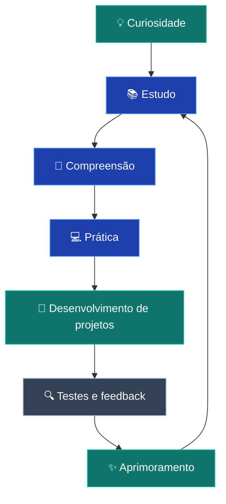

 

  

   

  # 👋 Olá, eu sou Franz Kramer!

  ### 💻 Desenvolvedor em formação | Tecnologia • Código • Inovação

  **Transformando curiosidade em conhecimento e ideias em projetos.**

  

    Estudante de tecnologia, apaixonado por aprender, explorar novas ferramentas
    e desenvolver soluções que unem criatividade e programação.
  

  
  

    

  

---

## 🧑‍💻 Sobre mim

Sou estudante de tecnologia e desenvolvedor em formação, construindo minha trajetória por meio de estudos, experiências práticas e projetos próprios.

Atualmente, estou desenvolvendo minha base em programação e desenvolvimento de sistemas no ambiente **SESI/SENAI**, buscando transformar o conhecimento adquirido em soluções reais.

Gosto de entender como a tecnologia funciona, experimentar novas ideias e enfrentar desafios que me ajudem a evoluir como desenvolvedor.

- 🎓 **Formação:** Estudante de Análise e Desenvolvimento de Sistemas.
- 🌱 **Aprendizado:** Fundamentos de programação, lógica e desenvolvimento de software.
- 🔍 **Interesses:** Tecnologia, automação, inovação e resolução de problemas.
- 🛠️ **Prática:** Projetos acadêmicos, experimentos e desenvolvimento pessoal.
- 🎯 **Objetivo:** Construir aplicações úteis e aprimorar continuamente minhas habilidades.

---

## 🚀 Atualmente

| 📚 Estudando | 💻 Desenvolvendo | 🎯 Buscando |
|:---:|:---:|:---:|
| Fundamentos de programação | Projetos práticos | Evolução técnica |
| Lógica e algoritmos | Aplicações e experimentos | Boas práticas |
| Ferramentas de desenvolvimento | Documentação | Novos desafios |

---

## 🛠️ Tecnologias e ferramentas

As tecnologias abaixo representam ferramentas que estou explorando, estudando ou utilizando em meus projetos. Minha experiência com cada uma delas continua evoluindo.

### 💡 Linguagens de programação

### 🌐 Desenvolvimento web

### ⚙️ Ferramentas e ambiente de desenvolvimento

### 📖 Outros conhecimentos

---

## 📂 Projetos em destaque

Aqui estão alguns espaços para apresentar os projetos que representam minha evolução e minhas experiências com programação.

> **Personalize esta seção:** substitua os exemplos pelos links dos seus repositórios reais e descreva o que você efetivamente desenvolveu em cada um.

<table>
  <tr>
    <td width="50%">
      <h3 align="center">💻 Projeto em destaque 1</h3>
      

        
      

      

        Descreva aqui seu projeto principal, o problema que ele resolve e as tecnologias que você utilizou.
      

    </td>
    <td width="50%">
      <h3 align="center">🐍 Projeto em destaque 2</h3>
      

        
      

      

        Apresente aqui uma aplicação ou exercício mais completo que demonstre suas habilidades em programação.
      

    </td>
  </tr>
  <tr>
    <td width="50%">
      <h3 align="center">⚡ Projeto em destaque 3</h3>
      

        
      

      

        Mostre aqui um projeto acadêmico ou pessoal e explique sua contribuição e seus aprendizados.
      

    </td>
    <td width="50%">
      <h3 align="center">📚 Estudos e exercícios</h3>
      

        
      

      

        Repositório para registrar exercícios, desafios de lógica e experimentos realizados durante os estudos.
      

    </td>
  </tr>
</table>

---

## 🧭 Minha jornada de aprendizagem

Acredito que a evolução na programação acontece por meio de um processo constante de aprendizado, experimentação e melhoria.

### 📌 Próximos objetivos

- [ ] Aprimorar minha lógica de programação e resolução de problemas.
- [ ] Desenvolver projetos pessoais mais completos.
- [ ] Melhorar a organização e a documentação dos meus repositórios.
- [ ] Praticar testes e boas práticas de desenvolvimento.
- [ ] Explorar novas tecnologias e ferramentas.
- [ ] Compartilhar meus projetos e aprendizados com a comunidade.

---

## 📊 Estatísticas do GitHub

  

  

  

---

## 🌟 O que valorizo em meus projetos

| Princípio | Como aplico |
|:---|:---|
| 🧠 **Aprender fazendo** | Transformo conceitos estudados em pequenos projetos e experimentos. |
| 🎯 **Clareza** | Busco escrever códigos e documentações fáceis de entender. |
| 🔄 **Evolução contínua** | Aprendo com erros, reviso soluções e procuro melhorar meu trabalho. |
| 🤝 **Colaboração** | Valorizo a troca de ideias e o desenvolvimento em equipe. |
| 💡 **Criatividade** | Exploro diferentes maneiras de solucionar problemas. |

---

## 📫 Vamos nos conectar?

Estou aberto a trocar ideias sobre tecnologia, programação, projetos e aprendizagem.

  

  

  

    

  

  **Construindo conhecimento, um projeto de cada vez.* 🚀

