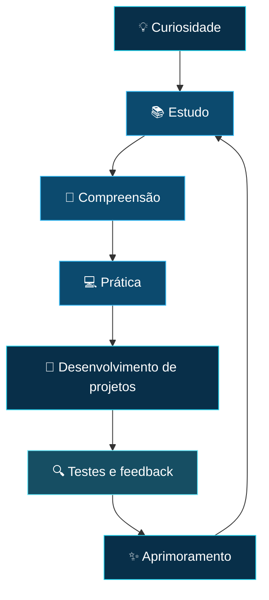

 <div align="center">

  

  <br>

  `RAY TECH // PROFILE 01`

  # 👋 Olá, eu sou Franz Kramer!

  ### 💻 Desenvolvedor em formação | Software • Automação • Soluções digitais

  **Construindo soluções com curiosidade, lógica e visão de futuro.**

  <p>
    Estudante de Análise e Desenvolvimento de Sistemas no SESI/SENAI,
    focado em transformar aprendizado técnico em experiências digitais úteis,
    organizadas e prontas para evoluir.
  </p>

  <a href="https://github.com/franzkramerfr-dev">
    
  </a>
  <a href="mailto:SEU_EMAIL_AQUI">
    
  </a>

  <br><br>

  

</div>

---

## 🧑‍💻 Sobre mim

Sou estudante de tecnologia e desenvolvedor em formação, construindo uma base sólida em programação, desenvolvimento de sistemas e resolução de problemas.

No ambiente **SESI/SENAI**, venho transformando conceitos em prática e desenvolvendo a mentalidade necessária para criar software com clareza, organização e propósito.

Gosto de entender o problema antes de escrever o código, explorar novas ferramentas e evoluir por meio de desafios que aproximam estudo e realidade profissional.

- 🎓 **Formação:** Estudante de Análise e Desenvolvimento de Sistemas.
- 🌱 **Aprendizado:** Fundamentos de programação, lógica e desenvolvimento de software.
- 🔍 **Interesses:** Tecnologia, automação, inovação e resolução de problemas.
- 🛠️ **Prática:** Projetos acadêmicos, experimentos e desenvolvimento pessoal.
- 🎯 **Objetivo:** Contribuir com equipes que valorizem aprendizado, inovação e soluções bem construídas.

### ⚡ Meu diferencial

Ainda estou no início da carreira, mas já desenvolvo uma postura profissional: aprendo rápido, documento o que faço, busco entender o contexto e trato cada desafio como uma oportunidade de melhorar a solução e a mim mesmo.

```text
PENSAMENTO       Ação com propósito, não código por código
APRENDIZADO      Curiosidade convertida em prática
DESENVOLVIMENTO  Clareza, organização e evolução contínua
AMBIENTE IDEAL   Times que compartilham conhecimento
```

---

## 🚀 Momento atual

<div align="center">

| 📚 Estudando | 💻 Praticando | 🎯 Construindo |
|:---:|:---:|:---:|
| Fundamentos de programação | Projetos práticos | Repertório técnico |
| Lógica e algoritmos | Aplicações e experimentos | Boas práticas |
| Ferramentas de desenvolvimento | Documentação | Conexões profissionais |

</div>

---

## 🛠️ Stack em evolução

Estas são as tecnologias e ferramentas que fazem parte da minha rotina de estudos e prática. Estou construindo profundidade com consistência, sempre priorizando fundamentos antes de ampliar a stack.

### 💡 Linguagens de programação

<div align="center">


</div>

### 🌐 Desenvolvimento web

<div align="center">


</div>

### ⚙️ Ferramentas e ambiente de desenvolvimento

<div align="center">


</div>

### 📖 Outros conhecimentos

<div align="center">


</div>

---

## 🧭 Minha jornada de aprendizagem

Acredito que a evolução na programação acontece por meio de um processo constante de aprendizado, experimentação e melhoria.



### 📌 Próximos objetivos

- [ ] Aprimorar minha lógica de programação e resolução de problemas.
- [ ] Desenvolver projetos pessoais mais completos.
- [ ] Melhorar a organização e a documentação dos meus repositórios.
- [ ] Praticar testes e boas práticas de desenvolvimento.
- [ ] Explorar novas tecnologias e ferramentas.
- [ ] Compartilhar meus projetos e aprendizados com a comunidade.

---

## 📊 Estatísticas do GitHub

<div align="center">

  

  

</div>

<div align="center">

  

</div>

---

## 🌟 O que valorizo em meus projetos

<div align="center">

| Princípio | Como aplico |
|:---|:---|
| 🧠 **Aprender fazendo** | Transformo conceitos estudados em pequenos projetos e experimentos. |
| 🎯 **Clareza** | Busco escrever códigos e documentações fáceis de entender. |
| 🔄 **Evolução contínua** | Aprendo com erros, reviso soluções e procuro melhorar meu trabalho. |
| 🤝 **Colaboração** | Valorizo a troca de ideias e o desenvolvimento em equipe. |
| 💡 **Criatividade** | Exploro diferentes maneiras de solucionar problemas. |

</div>

---

## 📫 Vamos nos conectar?

Estou aberto a trocar ideias sobre tecnologia, programação, projetos e aprendizagem.

<div align="center">

  <a href="https://github.com/franzkramerfr-dev">
    
  </a>

  <a href="LINK_DO_LINKEDIN">
    
  </a>

  <a href="mailto:SEU_EMAIL_AQUI">
    
  </a>

  <br><br>

  

  **Construindo conhecimento, um projeto de cada vez.* 🚀

</div>